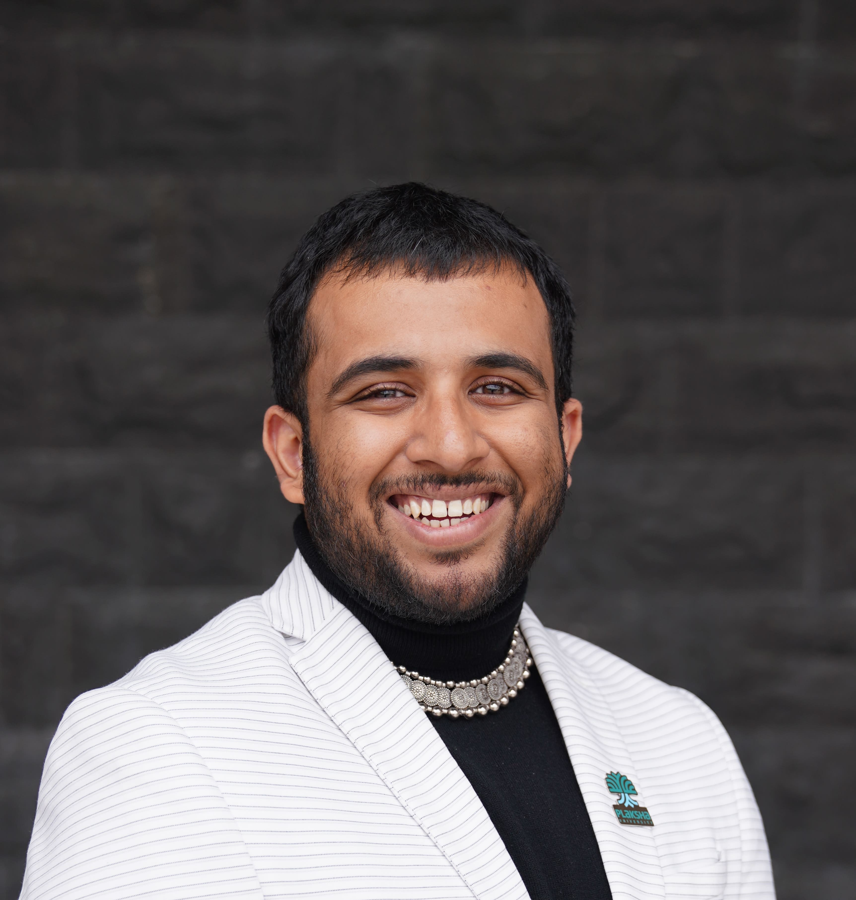

::: {.hero}

::: {.hero-photo}
{fig-alt="Sahil Mittal"}
:::

::: {.hero-text}

# Sahil Mittal {.hero-name}

[Interested in Labor Economics, Transit and Education Policy]{.hero-tagline}

I'm a first-year MSPPM-DA student at Carnegie Mellon's Heinz College, working on
empirical questions in labor economics and education policy.

I spent four years at Plaksha University, a new private institution in Punjab.
Two of them went into building its Office of Corporate Partnerships and Careers
from nothing — strategy, operations and employer relationships for 700+ students
at a university with no placement record to trade on. The last year was in the
Vice Chancellor's office, on institutional strategy and applied governance
projects with Invest Punjab.

Watching which students got hired, and which didn't, is what moved me from
operating inside a labor market to studying one.

```{=html}
<div class="hero-links">
  <a href="https://github.com/sahilmittal-policy"><i class="bi bi-github"></i> GitHub</a>
  <a href="https://www.linkedin.com/in/sahil-mittal-594925146/"><i class="bi bi-linkedin"></i> LinkedIn</a>
  <a href="mailto:sahilmit@andrew.cmu.edu"><i class="bi bi-envelope"></i> Email</a>
  <a href="files/sahil-mittal-cv.pdf"><i class="bi bi-file-earmark-text"></i> CV</a>
</div>
```

:::

:::

## Right now {.section-heading}

::: {.now-grid}

::: {.now-card}
[Fellowship]{.now-tag}

#### BRIDGE Program

Inaugural cohort of Heinz College's dialogue and governance program, run with
Pitt's School of Public and International Affairs. Eight months of civil
discourse, mediation and conflict management.
:::

::: {.now-card}
[Project]{.now-tag}

#### MBTA equity corridors

Ranked every MBTA bus route by transit dependence weighted by ridership, then
built the cost-benefit case for a $6.5M bus-priority package. Second place at the
MIT Policy Hackathon.

[See the project →](/projects/mbta-equity-corridors.html)
:::

::: {.now-card}
[In progress]{.now-tag}

#### Reading data analysis

Several years of my own Goodreads library, tested against a hunch: that fiction
absorbs the shock of major life transitions while nonfiction holds steady.

[Repository →](https://github.com/sahilmittal-policy/goodreads-reading-analysis)
:::

:::

## Where I've been {.section-heading}

```{=html}
<div class="logo-grid">

  <div class="logo-card">
    <div class="logo-well"></div>
    <div class="logo-name">Heinz College</div>
    <div class="logo-role">MSPPM, Data Analytics</div>
    <div class="logo-years">2026&ndash;28</div>
  </div>

  <div class="logo-card">
    <div class="logo-well"></div>
    <div class="logo-name">Plaksha University</div>
    <div class="logo-role">Strategy, Vice Chancellor's office &middot; Corporate Partnerships &amp; Careers</div>
    <div class="logo-years">2022&ndash;26</div>
  </div>

  <div class="logo-card">
    <div class="logo-well"></div>
    <div class="logo-name">Ashoka University</div>
    <div class="logo-role">Young India Fellowship, Liberal Studies</div>
    <div class="logo-years">2021&ndash;22</div>
  </div>

  <div class="logo-card">
    <div class="logo-well"></div>
    <div class="logo-name">NIT Tiruchirappalli</div>
    <div class="logo-role">B.Tech, Electrical &amp; Electronics Engineering<br><span class="logo-minor">Minor in Physics</span></div>
    <div class="logo-years">2017&ndash;21</div>
  </div>

</div>
```

## Learning to disagree well {.section-heading}

::: {.split}

::: {.split-media}
{.rounded-photo fig-alt="The inaugural BRIDGE cohort at the kickoff session"}
[The inaugural BRIDGE cohort at the kickoff session, University of Pittsburgh, September 2026.]{.photo-caption}
:::

::: {.split-text}
Policy analysis assumes that someone, eventually, will be persuaded. BRIDGE is
eight months of taking that assumption seriously — workshops on civil discourse,
mediation and conflict management, run jointly by Heinz and Pitt SPIA, ending in
a student-led campus event next spring.

It's the part of the training that doesn't show up in a regression table.
:::

:::

## Teaching {.section-heading}

::: {.prose}
Teaching is where the education-policy interest actually started. It is one thing
to read that pedagogy matters, another to watch a structured reasoning task land
with thirty students and miss five.
:::

```{=html}
<div class="course-list">

  <div class="course">
    <div class="course-head">
      <span class="course-title">Social Ventures &amp; Technology Disruptions</span>
      <span class="course-when">Plaksha &middot; 2023</span>
    </div>
    <div class="course-prof">Prof. Seema Bansal &middot; Punjab Development Commission</div>
    <div class="course-note">Teaching assistant for an undergraduate cohort of 60. Supported discussions on technology and social impact, mentored student teams through project development, and gave feedback on assignments and presentations.</div>
  </div>

  <div class="course">
    <div class="course-head">
      <span class="course-title">Entrepreneurial Challenge Lab</span>
      <span class="course-when">Plaksha &middot; 2023</span>
    </div>
    <div class="course-prof">Prof. Mark Searle &middot; UC Berkeley</div>
    <div class="course-note">Teaching assistant across two postgraduate and one undergraduate cohort, running lectures and team presentations. Thirty teams pitched startups on the final day.</div>
  </div>

  <div class="course">
    <div class="course-head">
      <span class="course-title">Design Thinking &amp; Systems Thinking</span>
      <span class="course-when">Plaksha &middot; 2023</span>
    </div>
    <div class="course-prof">Prof. Panchal &amp; Prof. Kenley &middot; Purdue University</div>
    <div class="course-note">Instructional support for a cohort of 50, delivering tutorials and exercises on structured problem-solving.</div>
  </div>

  <div class="course">
    <div class="course-head">
      <span class="course-title">Mathematics &amp; English, middle school</span>
      <span class="course-when">The Levelfield School, West Bengal &middot; 2022</span>
    </div>
    <div class="course-prof">Senior teacher</div>
    <div class="course-note">A hundred students on the Cambridge board. Socratic questioning, structured reasoning tasks, manipulative-based concept building and continuous skills assessment &mdash; the year that turned an interest in education into a research question.</div>
  </div>

</div>
```

## Outreach and community {.section-heading}

::: {.elsewhere}

::: {.elsewhere-item}
[Zeroing In: The Science Podcast]{.elsewhere-title}
Chief editor for three seasons of conversations with Indian scientists, including
B. N. Suresh, former director of the Vikram Sarabhai Space Centre, and Rajesh
Gopakumar, director of ICTS-TIFR. Ran sessions connecting researchers with 500+
school students.
:::

::: {.elsewhere-item}
[Nakshatra, NIT Trichy]{.elsewhere-title}
Led the astronomy society's thirty-person team, including the construction of a
student-built radio telescope and an annual festival that drew 400+ participants.
:::

::: {.elsewhere-item}
[Girls and Women in STEM, Plaksha]{.elsewhere-title}
Core team; convener of the Internal Complaints Committee and lead for the PRISM
LGBTQ+ inclusion initiative.
:::

:::

## Off the clock {.section-heading}

::: {.prose}
I read a lot and keep obsessive records of it, which is how the Goodreads project
started. I cook mostly by improvisation — whatever the pantry has, whatever it
turns into. Both are, I suspect, the same instinct: a preference for working with
what's actually in front of you rather than what the plan called for.
:::
